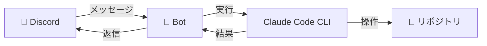
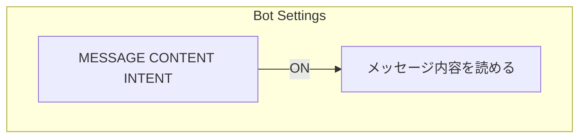
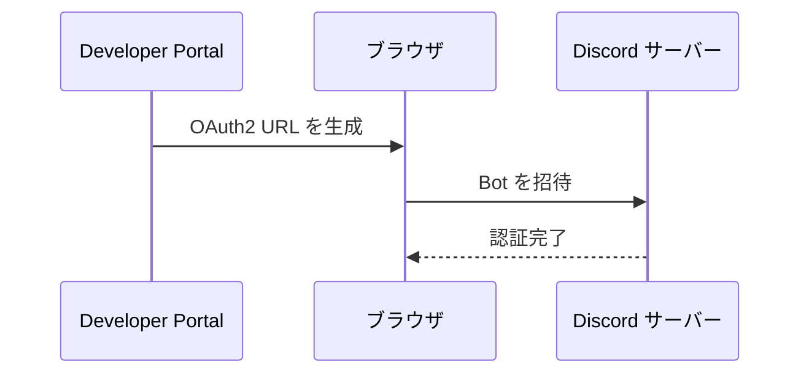
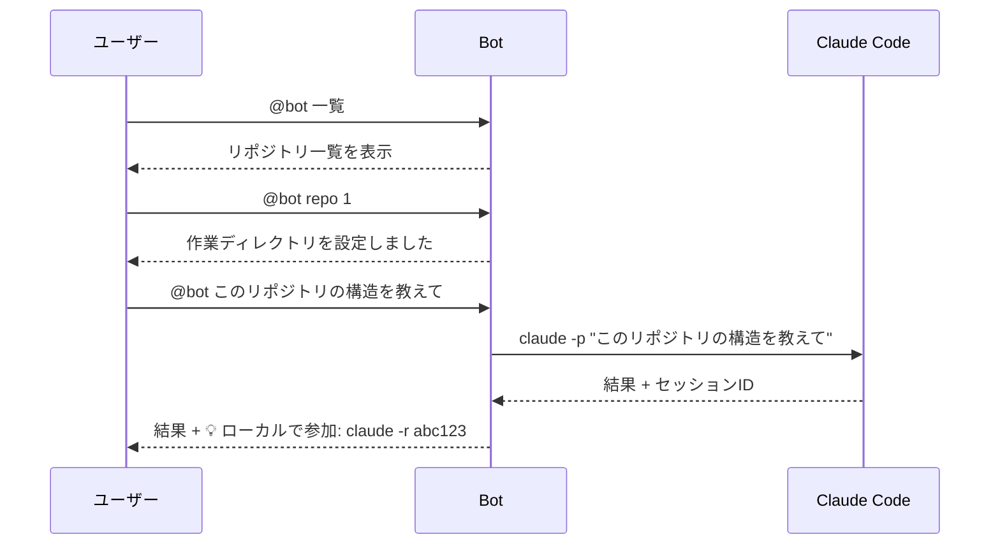
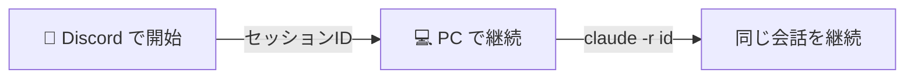

# Claude Remote Pilot

Discord から Claude Code を遠隔操作できるボットです。スマホからでもコード分析・改修を依頼できます。

## 概要



### 特徴

- **リモート操作**: スマホの Discord アプリからコード作業を依頼
- **セッション継続**: Discord で始めた会話をローカル PC で `claude -r <id>` で継続可能
- **複数リポジトリ対応**: チャンネルごとに作業ディレクトリを切り替え

---

## セットアップ

### 1. Discord Bot の作成

#### 1-1. アプリケーション作成

1. [Discord Developer Portal](https://discord.com/developers/applications) にアクセス
2. 右上の **「New Application」** をクリック
3. 名前を入力（例: `Claude Pilot`）して **「Create」**

#### 1-2. Bot の設定

1. 左メニューから **「Bot」** を選択
2. **「Reset Token」** をクリックしてトークンを取得（**必ず控えておく！**）
3. 以下の設定を有効化:



| 設定項目 | 値 |
| --------- | ----- |
| PUBLIC BOT | OFF（自分専用なら） |
| MESSAGE CONTENT INTENT | **ON（必須）** |

#### 1-3. Bot をサーバーに招待

1. 左メニューから **「OAuth2」→「URL Generator」** を選択
2. **SCOPES** で `bot` にチェック
3. **BOT PERMISSIONS** で以下にチェック:
   - `Send Messages`
   - `Read Message History`
4. 生成された URL をコピーしてブラウザで開く
5. 招待したいサーバーを選択して **「認証」**



---

### 2. プロジェクトのセットアップ

#### 2-1. クローン & インストール

```bash
git clone git@github.com:yushiesah7/claude-remote-pilot.git
cd claude-remote-pilot
npm install
```

#### 2-2. 環境変数の設定

`.env` ファイルを作成（`.env.example` をコピーして使う）:

```bash
cp .env.example .env
```

`.env` に値を設定:

```bash
DISCORD_TOKEN=あなたのボットトークン
# 推奨: 操作を自分だけに限定（カンマ区切りで複数指定可）
ALLOWED_USER_IDS=あなたのユーザーID
```

##### 自分のユーザーIDの取得方法

`ALLOWED_USER_IDS` に設定する「ユーザーID」は、Discordの表示名ではなく 18〜19 桁の数字です。

1. Discord の「設定」→「詳細設定」→「開発者モード」を ON
2. 自分のユーザーIDをコピー
   - PC: 自分のアイコン（ユーザー名）を右クリック →「ユーザーIDをコピー」
   - スマホ: 自分のプロフィール →「…」→「IDをコピー」（表示は環境により異なる場合があります）

#### 2-3. パスの設定（必要に応じて）

`PROJECTS_ROOT` と `CLAUDE_BIN` は環境に合わせて設定してください（おすすめ: `.env` に設定）。

```javascript
// プロジェクトの親ディレクトリ
const PROJECTS_ROOT = process.env.PROJECTS_ROOT || process.cwd();

// Claude CLI のパス（`which claude` で確認）
const claudeBin = process.env.CLAUDE_BIN || 'claude';
```

---

### 3. 起動

```bash
node index.js
```

起動成功時:
```text
ボット起動完了: Claude Pilot#1234
```

---

## 使い方

### Bot の呼び出し方

以下のいずれかでボットが反応します:

- `@Bot名 メッセージ`
- `claude メッセージ`

### コマンド一覧

| コマンド | 説明 |
| --------- | ------ |
| `repolist` / `一覧` | 利用可能なリポジトリを表示 |
| `repo 名前` / `repo 番号` | 作業ディレクトリを設定 |
| `reset` / `リセット` | セッションをリセット |
| `session` / `セッション` | 現在の設定を表示 |
| `help` / `ヘルプ` | ヘルプを表示 |

### 使用例



---

## ローカルとの連携

Discord で始めた会話は、PC に戻ったらローカルで継続できます。

### 手順

1. Discord でボットに作業を依頼
2. 完了メッセージに表示されるセッション ID を確認
3. PC のターミナルで:

```bash
cd /path/to/repo
claude -r <セッションID>
```



---

## トラブルシューティング

### Bot が反応しない

- **MESSAGE CONTENT INTENT** が ON になっているか確認
- `.env` のトークンが正しいか確認
- ボットがサーバーに参加しているか確認

### Claude Code がエラー

- `which claude` でパスを確認して `index.js` を修正
- Claude Code が正しくインストールされているか確認

---

## ライセンス

MIT
