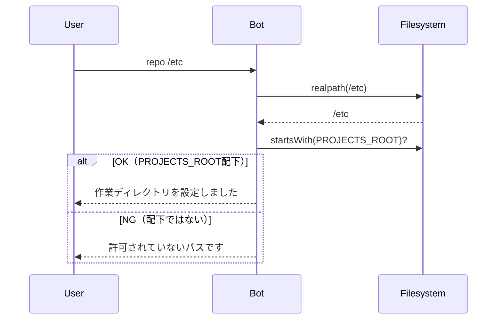
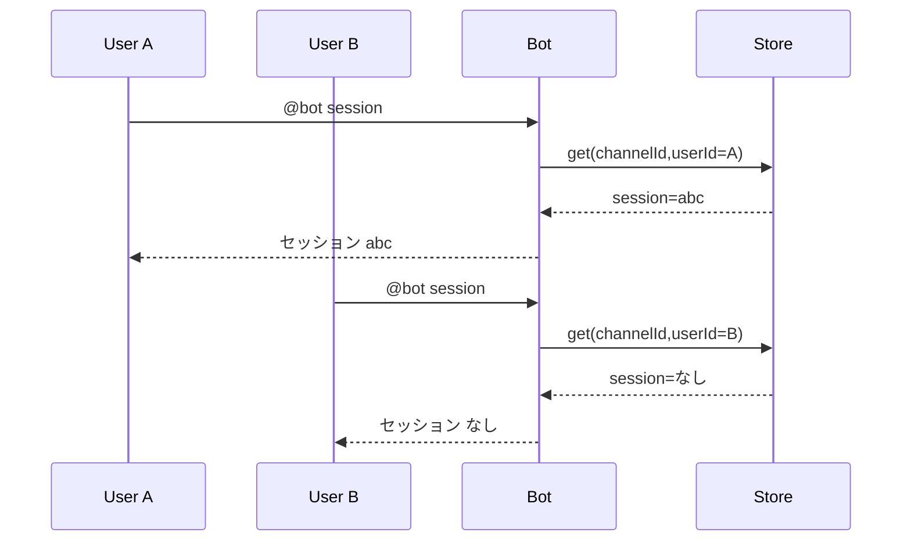
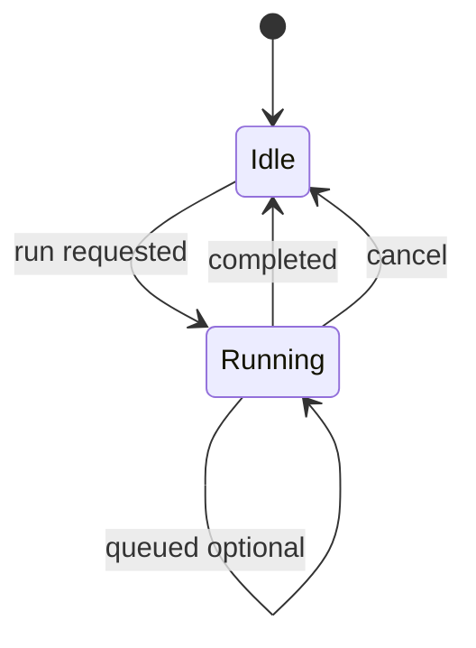
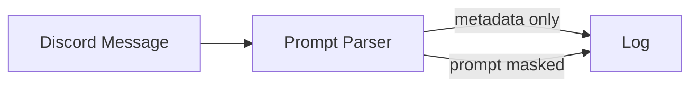
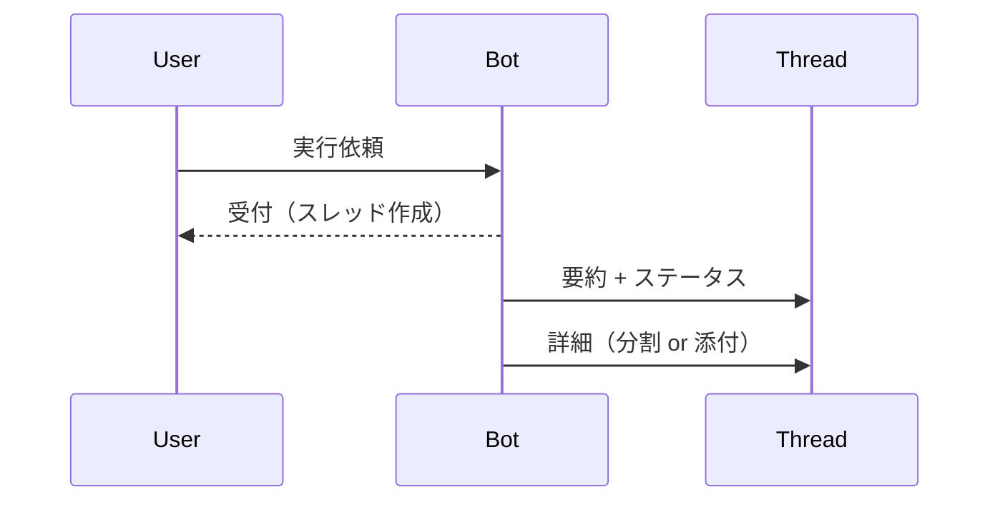
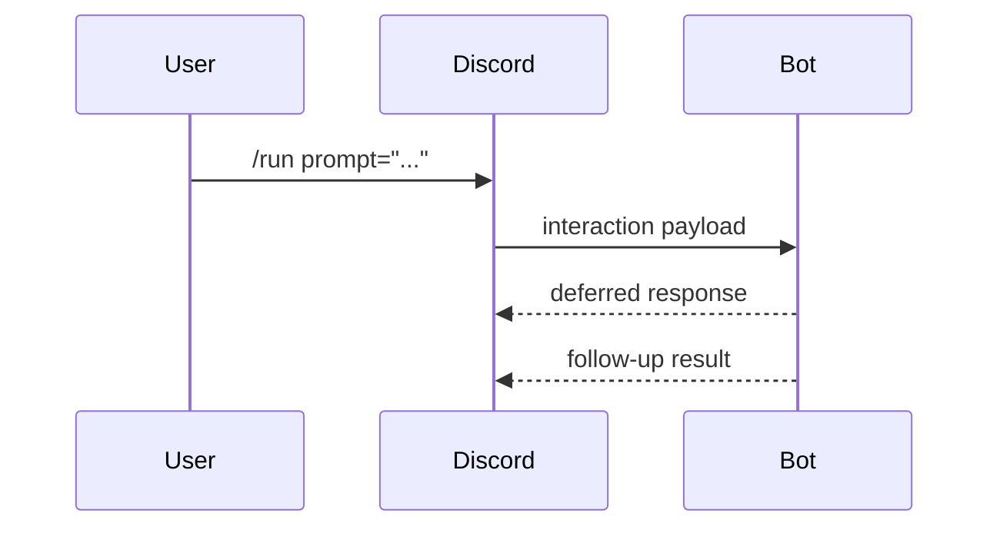
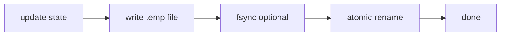
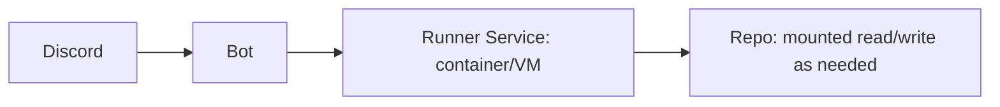
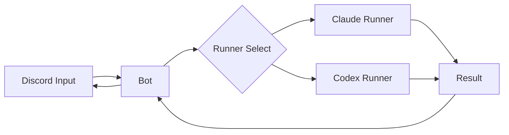
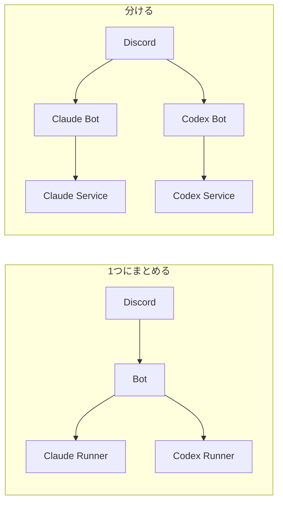

# 改善案（Before / After）

このリポジトリは「Discord の入力をトリガーに、ローカルの CLI（現在は `claude`）を実行して結果を返信する」ためのボットです。
便利な反面、“Discord 側の入力がローカル実行に直結する”ため、運用に合わせたガードレールを入れるほど安全・安定になります。

このドキュメントでは、改善案ごとに「いま（Before）/取り入れると（After）」がどう変わるかを整理します。

---

## 1. `repo` のパス制限（サンドボックス化）

### Before（現状）

- `repo` コマンドで絶対パスを指定でき、存在すればそのまま `cwd` として採用される
- `PROJECTS_ROOT` は「一覧表示の基準」にはなるが、「実際に設定できる範囲」の制約になっていない

### After（導入後）

- `repo` の候補パスを `realpath` 化し、`PROJECTS_ROOT` 配下のみ許可する
- 逸脱（`..` やシンボリックリンクで外へ出る等）は拒否する
- 追加で `ALLOWED_REPOS`（許可ディレクトリの明示リスト）方式にすると、より堅い

---

## 2. セッション/設定スコープを「チャンネル」→「ユーザー」に寄せる

### Before（現状）

- セッションIDや作業ディレクトリが `channelId` 単位で共有される
- 同一チャンネルに別ユーザーが参加した場合、意図せず“同じ状態”を共有してしまう

### After（導入後）

- `channelId + userId` をキーにして状態を分離する（DMは `userId` 単独でも可）
- 「個人運用」でも、将来チャンネルに人が入った時の事故を防げる

---

## 3. 同時実行制御（キュー/ロック）と `cancel`

### Before（現状）

- メッセージが来るたびに実行が走る（多重起動し得る）
- 実行中に「やっぱ止めたい」ができない
- 重い処理を連投するとローカルが詰まりやすい

### After（導入後）

- `channelId` または `channelId+userId` 単位で「実行中ロック」を持つ
- 実行中は「受付だけしてキュー」「busyで拒否」「上書き」など方針を選べる
- `cancel` で child process を kill できる（PID管理）

---

## 4. ログの最小化/マスク

### Before（現状）

- `message.content` / `prompt` をそのままログ出力すると、秘密情報（トークン・鍵・URL等）が残りやすい

### After（導入後）

- デフォルトは「メタ情報（userId/channelId/実行時間/exitCode）」中心にする
- `LOG_LEVEL=debug` 時のみ詳細ログを出す、または `prompt` をマスクして出す

---

## 5. 結果の返し方（UX）

### Before（現状）

- 長文は分割して複数メッセージ送信（チャンネルが流れやすい）

### After（導入後）

- 返信をスレッドに集約（チャンネルを汚さない）
- 1通目は「要約 + 主要リンク/次アクション」、全文は添付（テキストファイル）や続きメッセージに
- 失敗時は「何が起きたか（stderr/exitCode）」を短く出す

---

## 6. スラッシュコマンド化（Interactions）

### Before（現状）

- メッセージ本文を読むために Message Content Intent が必要
- パースが自由入力依存で、操作ミスや曖昧さが残る

### After（導入後）

- `/run prompt:"..." runner:"claude"` のように引数を構造化できる
- `/repo select:<choice>` で安全に選ばせられる
- 将来の拡張（権限・選択肢・補完）がしやすい

---

## 7. `bot-data.json` の堅牢化（原子書き込み/SQLite）

### Before（現状）

- JSONファイルを読み書きするため、同時書き込みや途中停止で壊れる可能性がある

### After（導入後）

- まずは「テンポラリに書く → `rename` で置換」の原子書き込みにする
- さらに堅くしたいなら SQLite（`better-sqlite3` 等）で `sessions` / `repos` を管理する

---

## 8. 実行環境の分離（被害範囲を小さく）

### Before（現状）

- ボットが動くユーザー権限で、CLIがローカルのリポジトリ/ファイルへアクセスする

### After（導入後）

- 専用ユーザーで起動（最低権限）
- 可能ならコンテナ/VM上で実行し、マウント/ネットワーク/権限を絞る

---

## 9. Claude 以外（Codex 等）への拡張：Runner 抽象化

「Discord → Bot → CLI」の形はそのままに、実行対象を切り替えられるようにするのが王道です。

### Before（現状）

- `claude` 固定の実行フロー（runnerが1種類）

### After（導入後）

- `runner` インターフェイスを作り、`claude`/`codex` を差し替え可能にする
- 例: `@bot codex: <prompt>` / `@bot claude: <prompt>` や `/run runner:codex`
- それぞれの「セッションの持ち方」「出力形式」「エラーの出方」を吸収できる

### 1アプリにまとめる vs 別アプリに分ける

| 方針 | Before / After（どう変わる） |
| --- | --- |
| 1つにまとめる | **After:** Botが1つで運用が楽。Runner抽象化で拡張しやすいが、依存・設定・障害が同居する。 |
| 分ける（別Bot/別サービス） | **After:** 依存や権限を分離しやすく、片方が落ちても片方が生きる。運用対象が増える。 |

---

## 最小セット（おすすめ）

個人運用でも「入れると効く割にコストが低い」順に並べると、だいたい次です。

1. `repo` のパス制限（PROJECTS_ROOT配下のみ）
2. セッション/設定の `channelId+userId` 化
3. 同時実行制御 + `cancel`
4. ログ最小化（秘密が残らない）
